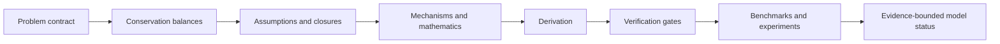

# Analytical

**From conservation laws to falsifiable engineering models.**

[](https://github.com/hanhuark/analytical/releases/latest)
[](https://github.com/hanhuark/analytical/actions/workflows/ci.yml)
[](../LICENSE)
[](../CITATION.cff)

Analytical is an open, physics-first [Codex skill](../SKILL.md) and standalone workflow for developing, challenging, and validating analytical or reduced-order mechanistic models. It is designed for problems in thermal fluids, heat transfer, fluid mechanics, phase change, boiling, and critical heat flux (CHF), while keeping the workflow reusable across other conservation-law-based engineering sciences.

It turns a modeling request into an inspectable package connecting:

- governing balances, system boundaries, signs, units, and reference frames;
- assumptions, closures, mathematical tools, and limiting cases;
- primary sources, public models, benchmarks, and experimental evidence;
- falsification tests, uncertainty, failure modes, and an evidence-bounded claim status.

> **Evidence status:** the skill structure, package schemas, validators, examples, and regression tests are exercised in CI. That does not establish the scientific validity of a new model. Validity remains specific to the derivation, sources, data, regime, and independent tests supplied for each problem.

## Why use it?

Plausible equations are easy to generate. Traceable models are harder. Analytical requires every important reduction to remain connected to the balance it modifies, the assumption that permits it, the evidence that supports it, and an observation that could falsify it.



Use Analytical when the central result is a mechanistic derivation, scaling law, closure model, instability threshold, assumption audit, falsification analysis, or mechanism-discriminating validation plan. It is not intended for generic literature summaries, routine curve fitting, manuscript editing, or numerical setup when no analytical model is being created or audited.

## Quick start

### Install as a Codex skill

Clone the repository into the Codex skills directory.

macOS or Linux:

```bash
skill_root="${CODEX_HOME:-$HOME/.codex}/skills"
mkdir -p "$skill_root"
git clone https://github.com/hanhuark/analytical.git "$skill_root/analytical"
```

Windows PowerShell:

```powershell
$skillRoot = if ($env:CODEX_HOME) { Join-Path $env:CODEX_HOME "skills" } else { Join-Path $HOME ".codex\skills" }
New-Item -ItemType Directory -Force -Path $skillRoot | Out-Null
git clone https://github.com/hanhuark/analytical.git (Join-Path $skillRoot "analytical")
```

Once the skill is available to Codex, invoke it explicitly with `$analytical` and select the smallest suitable mode:

```text
Use $analytical in audit mode to reconstruct and challenge a saturated
pool-boiling CHF model. Audit the system boundary, interfacial balances,
property-evaluation states, closures, asymptotic limits, and validation evidence.
Do not promote the model beyond the evidence.
```

Other starting prompts:

```text
Use $analytical in derive mode to derive a conjugate transient heat-transfer
model from the integral energy balances. Define signs, units, interface
conditions, limiting cases, and a benchmark with a known solution.
```

```text
Use $analytical in explore mode to propose competing mechanisms for dry-spot
growth before boiling crisis. Give each mechanism a causal chain, scaling
skeleton, distinctive prediction, failure regime, and decisive experiment.
```

See the [prompt library](../references/prompt-library.md) for role-specific prompts.

### Use the package tools directly

The scaffolding and validation tools use the Python standard library and can be used independently of Codex:

```bash
python scripts/init_package.py my-analysis --mode derive
python scripts/validate_package.py my-analysis --mode derive
python scripts/check_resources.py --max-age-days 365
```

The validator checks the declared artifact contract, schemas, required sections, and recorded evidence. It cannot determine whether equations, citations, measurements, or conclusions are scientifically true.

## Workflow modes

| Mode | Best for | Claim ceiling |
|---|---|---|
| `explore` | Define the problem and compare physically distinct mechanisms | Qualitative hypothesis |
| `derive` | Close and derive one selected mechanism | Closed analytical model |
| `audit` | Reconstruct and challenge an existing theory, model, or correlation | No promotion beyond existing evidence |
| `validate` | Test an already closed model against sealed evidence | Independent validation only with cross-domain evidence |
| `full` | End-to-end theory development and validation | Evidence-dependent |

Detailed required artifacts and stop conditions are defined in [SKILL.md](../SKILL.md).

## What is included

| Resource | Purpose |
|---|---|
| [Governing physics](../references/governing-physics.md) | Integral and local balances, interface conditions, reductions, and invariance checks |
| [Mathematical toolkit](../references/mathematical-toolkit.md) | Method-selection requirements, transforms, stability, asymptotics, inverse methods, and failure modes |
| [Thermal-fluids guidance](../references/thermal-fluids.md) | Multiphase-flow, boiling-crisis, CHF, conjugate, and mechanism-specific checks |
| [Public resources](../references/public-resources.md) | Curated starting points for theory, implementations, standards, and public data |
| [Benchmark guidance](../references/benchmark-data.md) | Provenance, leakage control, uncertainty, domain shifts, and experiment design |
| [Verification gates](../references/verification-gates.md) | Conservation, dimensions, thermodynamics, algebra, identifiability, evidence, and novelty gates |
| [Reusable assets](../assets/) | Problem contract, audits, model card, verification report, benchmark, and experiment templates |
| [Evaluation protocol](../references/evaluation-protocol.md) | Blinded comparison and regression-testing design for assessing skill impact |

## Worked examples

- [Steady wall conduction](../examples/steady-wall-conduction/) demonstrates a completed `derive` package with an exact baseline and limiting-case checks.
- [Saturated pool-CHF audit](../examples/saturated-pool-chf-audit/) demonstrates an `audit` package whose qualified status preserves unresolved evidence and applicability limitations. It is not presented as experimental validation of a CHF theory.

## Verification

Run the same local checks used by CI:

```bash
python scripts/check_skill.py
python -m unittest discover -s tests -v
python scripts/validate_package.py examples/steady-wall-conduction --mode derive
python scripts/validate_package.py examples/saturated-pool-chf-audit --mode audit
python scripts/check_resources.py --max-age-days 365
```

CI runs these checks on Windows, Linux, and macOS with Python 3.10, 3.12, and 3.13.

## Contributing and scientific defect reports

Contributions are welcome when their assumptions, provenance, rights, and verification status are explicit. Read [CONTRIBUTING.md](../CONTRIBUTING.md) before proposing a new theory resource, benchmark, template, validator rule, or domain extension.

Use the structured [issue forms](https://github.com/hanhuark/analytical/issues/new/choose) to report:

- conservation, dimensional, interface, assumption, closure, or validation defects;
- relevant public theories, models, implementations, datasets, or benchmarks;
- workflow, documentation, schema, or usability improvements.

Do not post confidential research, restricted data, credentials, reviewer identities, student records, or sponsor-controlled material.

## Citation, license, and stewardship

If this repository supports research or teaching, use GitHub's **Cite this repository** control or the metadata in [CITATION.cff](../CITATION.cff). Claims about a model produced with the skill should cite the primary scientific sources and datasets used for that model; citing the skill does not replace those sources.

Analytical is released under the [Apache License 2.0](../LICENSE). It is maintained by [Han Hu](https://engineering.uark.edu/mechanical-engineering/faculty/uid/hanhu/name/Han+Hu/) through the [NED³ laboratory](https://ned3.uark.edu/) at the University of Arkansas, with connections to the [UA Power Group](https://uapower.group/research/).
